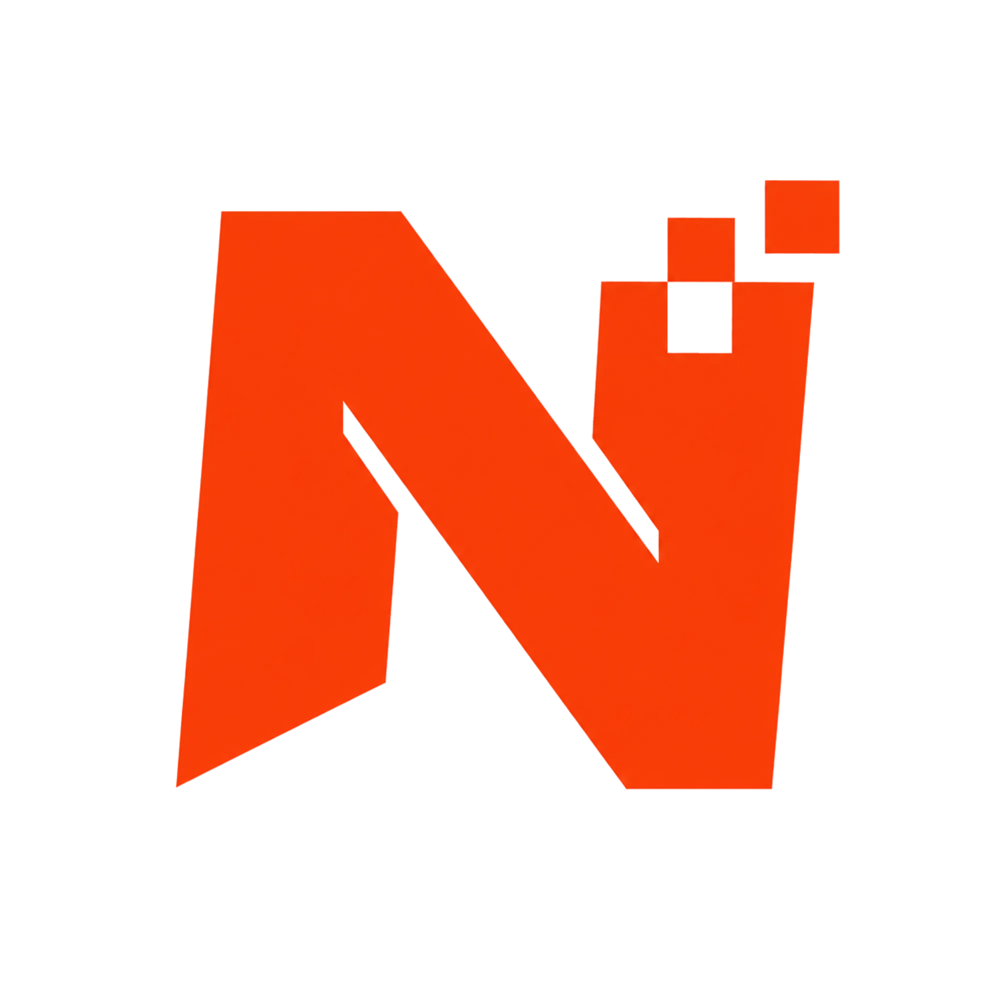

<p align="center">
  
</p>

<h1 align="center">Nicodigos</h1>

<p align="center">
  Store de productos digitales en Chile: keys, servicios SMM y catálogo Kinguin,<br />
  con checkout Flow.cl, panel admin y sync de proveedores.
</p>

<p align="center">
  <a href="docs/README.md">Documentación</a> ·
  <a href="docs/architecture.md">Arquitectura</a> ·
  <a href="docs/patterns.md">Patrones</a> ·
  <a href="docs/prisma.md">Prisma</a>
</p>

---

## Qué es

Nicodigos es una aplicación **Next.js 16** (App Router) + **Prisma 7** / PostgreSQL para vender y entregar productos digitales:

- Catálogo con categorías, assets (R2) e inventario de keys
- Tres métodos de entrega: **MANUAL**, **SMM** (paneles) y **KINGUIN** (ESA API)
- Carrito, wishlist, órdenes, deliveries y pagos **Flow.cl**
- Auth con **Better Auth** (email/OTP, OAuth opcional) y roles `USER` / `ADMIN`
- Crons de sync (SMM / Kinguin) que actualizan rates y reprecian con markup + FX (Redis)

## Stack

| Área           | Tecnología                                                          |
| -------------- | ------------------------------------------------------------------- |
| Runtime        | Bun, Next.js 16, React 19                                           |
| DB             | PostgreSQL, Prisma 7 (`@prisma/adapter-pg`)                         |
| Auth           | Better Auth + Prisma adapter                                        |
| Pagos          | Flow.cl (`@nicotordev/flowcl-pagos`)                                |
| Media          | Cloudflare R2 (S3 API)                                              |
| UI             | Tailwind 4, shadcn / Base UI, TanStack Query & Table                |
| Email          | Resend + React Email                                                |
| Comunicaciones | Resend Inbound/Webhooks + OneSignal Web Push + soporte en vivo (WS) |

## Requisitos

- Bun
- PostgreSQL
- Redis (cache USD/EUR → CLP)
- Credenciales opcionales según feature: Flow, R2, Kinguin, Resend, OpenAI, Sentry

## Setup

```bash
bun install
cp .env.example .env
# Editar DATABASE_URL, BETTER_AUTH_*, CRON_SECRET, etc.

# Base dedicada recomendada
# createdb nicodigos_store

bunx --bun prisma migrate deploy
bunx --bun prisma generate

bun run dev          # Next + pollers de cron + delivery worker + support WS
# o solo web:
bun run dev:web
# o solo gateway WS:
bun run worker:support-ws
```

Abrir [http://localhost:3000](http://localhost:3000). Admin: `/admin` (emails/dominios en `ADMIN_EMAILS`).

Para chat en vivo local: define `SUPPORT_WS_SECRET` y opcionalmente `NEXT_PUBLIC_SUPPORT_WS_URL=ws://127.0.0.1:3011/ws`.

## Scripts útiles

| Script                                   | Descripción                                |
| ---------------------------------------- | ------------------------------------------ |
| `bun run dev`                            | Web + crons + delivery worker + support WS |
| `bun run cron:sync-smm:once`             | Una pasada de sync SMM                     |
| `bun run cron:sync-kinguin:once`         | Una pasada de sync Kinguin                 |
| `bun run cron:cleanup-price-events:once` | Limpia eventos de precio viejos            |
| `bun run worker:delivery`                | Worker BullMQ de fulfillment y email       |
| `bun run worker:support-ws`              | Gateway WebSocket de soporte en vivo       |
| `bun run build` / `bun run start`        | Producción                                 |

En producción, ejecuta `bun run worker:delivery` como proceso persistente y programa
`GET` o `POST /api/cron/publish-outbox` con `CRON_SECRET` (idealmente cada minuto).
El proceso web por sí solo no consume las colas BullMQ.

## Lógica del dominio (resumen)

```
Catálogo (Product) ──deliveryMethod──► MANUAL | SMM | KINGUIN
        │
        ▼
Carrito → Checkout Flow → Order + Payment → Delivery + OutboxEvent
                                                ↓
                                     BullMQ delivery / email
                                              │
                    sync crons ◄── SmmProvider / Kinguin ESA
                         │
                         ▼
              domain events → reprecio + ProductPriceChangeEvent
```

Mutaciones van por **Server Actions** (`src/lib/actions`) con `ActionResult<T>`; lecturas por **queries**; reglas de sync/reprecio por **eventos de dominio**. Detalle en [docs/patterns.md](docs/patterns.md) y [docs/prisma.md](docs/prisma.md).

## Prisma

Schema en `prisma/schema.prisma`, client generado en `src/generated/prisma`, singleton en `src/lib/prisma.ts`.

```bash
bunx --bun prisma migrate dev --name my_change
bunx --bun prisma studio
```

## Cloudflare R2

Imágenes de producto/categoría suben con URL firmada al bucket S3-compatible. Variables:

```bash
R2_ACCOUNT_ID=
R2_ACCESS_KEY_ID=
R2_SECRET_ACCESS_KEY=
R2_BUCKET=
R2_PUBLIC_URL=https://media.example.com
```

CORS del bucket (origen = tu admin):

```json
[
  {
    "AllowedOrigins": ["https://example.com"],
    "AllowedMethods": ["PUT"],
    "AllowedHeaders": ["Content-Type", "Cache-Control"],
    "ExposeHeaders": ["ETag"],
    "MaxAgeSeconds": 3600
  }
]
```

## Comunicaciones

El módulo operativo vive en `/admin/communications`. Para correo entrante, configura en Resend un dominio receptor (preferiblemente un subdominio con MX) y registra `POST /api/webhooks/resend` con los eventos de recepción y entrega. Define `RESEND_WEBHOOK_SECRET` con el signing secret del webhook.

Para web push, configura el origen HTTPS en OneSignal y usa el worker público `/push/onesignal/OneSignalSDKWorker.js` con scope `/push/onesignal/`. `NEXT_PUBLIC_ONESIGNAL_APP_ID` contiene solo el App ID público; la REST API key permanece privada. Ejecuta `/api/cron/process-communications` con `CRON_SECRET` al menos una vez por minuto para procesar envíos en cola y actualizar métricas.

## Documentación

- [Índice docs](docs/README.md)
- [Arquitectura y flujos](docs/architecture.md)
- [Patrones de código](docs/patterns.md)
- [Modelo Prisma](docs/prisma.md)

## Licencia

Proyecto privado (`private: true` en `package.json`).
