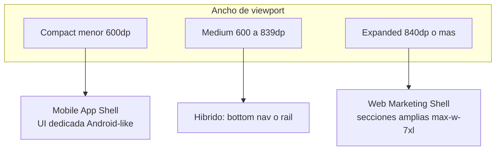

# Especificación UI — Nicodigos

Guía de diseño e implementación del storefront chileno: tokens, Tailwind CSS v4, shadcn/ui, patrones web y **superficie móvil dedicada** inspirada en Material Design 3 (Android). Todo el copy visible al usuario debe estar en **español** y alinearse con [KEYWORDS.md](./KEYWORDS.md).

---

## 1. Visión y audiencia

### Qué somos

Nicodigos es un **marketplace digital para Chile**: keys de juegos, gift cards (Steam, PlayStation, Xbox, Nintendo, etc.), licencias de software y suscripciones, con entrega automática y soporte local.

### Personalidad visual

| Atributo    | Dirección                                                                  |
| ----------- | -------------------------------------------------------------------------- |
| Tono        | Gamer premium, creativo y llamativo, sin parecer marketplace genérico gris |
| Confianza   | Claridad en precio, stock, activación y soporte en Chile                   |
| Energía     | Primary cálido (ámbar/naranja en OKLCH) como acento de marca               |
| Legibilidad | Contraste alto, jerarquía clara, CTAs obvios                               |

### Idioma y SEO

- **UI copy**: siempre en español (títulos, botones, vacíos, errores, tooltips).
- **SEO / keywords**: usar términos de [KEYWORDS.md](./KEYWORDS.md) en H1, secciones, badges y FAQs de forma natural (ej. “juegos digitales Chile”, “Steam wallet Chile”, “gift cards Chile”). Evitar keyword stuffing.
- **HTML**: el documento debe usar `lang="es"` en el layout raíz (`app/layout.tsx`). Si aún figura `lang="en"`, corregirlo en la fase de implementación.

### Principio rector

> **Responsive no significa encoger el desktop.** En viewports compactos se construye una **UI de aplicación Android**, no una versión reducida del sitio marketing.

---

## 2. Estrategia responsive dual

### Diagrama de superficies



### Breakpoints (Material 3 → Tailwind)

Material Design 3 clasifica el ancho en _window size classes_. Mapeo recomendado en este proyecto:

| Clase M3      | Ancho         | Dispositivo típico                   | Prefijos Tailwind          | Superficie                    |
| ------------- | ------------- | ------------------------------------ | -------------------------- | ----------------------------- |
| **Compact**   | &lt; 600dp    | Teléfono vertical                    | `max-md:` o `max-[599px]:` | **UI app** (shell móvil)      |
| **Medium**    | 600dp – 839dp | Tablet vertical, teléfono horizontal | `md:` hasta antes de `lg:` | Híbrido (nav inferior o rail) |
| **Expanded+** | ≥ 840dp       | Tablet horizontal, desktop           | `lg:` / `xl:`              | **Web marketing** actual      |

Referencias oficiales:

- [Window size classes](https://developer.android.com/develop/ui/compose/layouts/adaptive/use-window-size-classes)
- [Navegación adaptativa](https://developer.android.com/develop/ui/compose/layouts/adaptive/build-adaptive-navigation)
- [Material Design 3 en Compose](https://developer.android.com/develop/ui/compose/designsystems/material3)

### Dos familias de componentes

| Prefijo / familia | Cuándo usar                                | Ejemplos                                                             |
| ----------------- | ------------------------------------------ | -------------------------------------------------------------------- |
| **Web\***         | Expanded (≥ 840px): marketing, grids, hero | `HeroSection`, `SectionShell`, `PrimarySectionBand`, `GridPattern`   |
| **Mobile\***      | Compact (&lt; 600px): experiencia tipo app | `MobileAppShell`, `MobileBottomNav`, `MobileHomeScreen`, listas tile |

### Reglas obligatorias

1. **Prohibido** tratar móvil como “desktop con menos columnas” (solo `grid-cols-1`, `text-sm`, menú hamburguesa).
2. **Obligatorio** markup y jerarquía distintos entre superficies cuando la UX lo exija; no basta con ocultar columnas.
3. **Navegación principal en compact**: barra inferior (3–5 destinos), no drawer lateral como patrón principal (ver estado actual en `components/layout/header.tsx` — hoy usa `Sheet` lateral; es transitorio).

### Patrones de implementación (recomendados)

**Opción A — Route groups paralelos**

```
app/(marketing)/          → layout web
app/(marketing-mobile)/   → layout móvil (mismas rutas o alias)
```

Layout padre alterna visibilidad con `hidden lg:block` / `lg:hidden` o redirección por breakpoint.

**Opción B — Componentes gemelos en la misma ruta**

```tsx
<div className="hidden lg:block"><HeroSection /></div>
<div className="lg:hidden"><MobileHomeScreen /></div>
```

Usar solo si la estructura DOM es **realmente diferente**, no solo clases distintas en el mismo árbol.

### Checklist anti-patrón (PRs de UI)

- [ ] ¿Existe componente o layout **móvil dedicado** para la pantalla?
- [ ] ¿Targets táctiles ≥ 44×44 px?
- [ ] ¿La navegación principal es alcanzable con el pulgar (barra inferior)?
- [ ] ¿Se evitó copiar bloques de `examples/` sin mapear tokens semánticos?
- [ ] ¿El copy está en español y respeta KEYWORDS donde aplica?

### Estado actual vs objetivo

| Área         | Hoy                              | Objetivo                                              |
| ------------ | -------------------------------- | ----------------------------------------------------- |
| Header móvil | `Sheet` lateral (`side="right"`) | Bottom nav primaria; drawer/sheet secundario          |
| Home         | Mismas secciones con `sm:`/`lg:` | `MobileHomeScreen` con listas y carruseles snap       |
| Catálogo     | Grid + `glass-card` responsive   | Lista vertical full-bleed + detalle pantalla completa |
| Corte header | `lg:` (~1024px)                  | Alinear compact a &lt; 600dp para shell app           |

---

## 3. UI móvil tipo Android (Material 3)

### Shell de aplicación (`MobileAppShell`)

Estructura fija en viewports compact:

```
┌─────────────────────────────┐
│ Top App Bar (h-14)          │  ← título, back, acciones
├─────────────────────────────┤
│                             │
│  Contenido scroll (flex-1)  │  ← listas, detalle, formularios
│                             │
├─────────────────────────────┤
│ Bottom Navigation (fijo)    │  ← máx. 5 destinos
└─────────────────────────────┘
```

**Destinos sugeridos** (alineados a `lib/store/navigation.ts`):

| Ícono    | Etiqueta | Ruta                           |
| -------- | -------- | ------------------------------ |
| Inicio   | Inicio   | `/`                            |
| Catálogo | Catálogo | `/catalog`                     |
| Ofertas  | Ofertas  | `/offers`                      |
| Carrito  | Carrito  | `/cart`                        |
| Cuenta   | Cuenta   | `/auth/sign-in` o menú usuario |

Componente propuesto: `MobileBottomNav` en `components/layout/`. **No** usar `Sheet` como navegación principal.

### Mapeo M3 → web (Tailwind + shadcn)

| Patrón Material 3      | Implementación en Nicodigos                                                                                                                                                |
| ---------------------- | -------------------------------------------------------------------------------------------------------------------------------------------------------------------------- |
| **Top App Bar**        | `header` fijo `sticky top-0 z-50 h-14 border-b bg-background/95 backdrop-blur`; título `font-heading text-lg font-semibold`; acciones `Button variant="ghost" size="icon"` |
| **Navigation Bar**     | `nav` fijo `bottom-0 inset-x-0 h-16 border-t bg-background`; ítems con `min-h-11 min-w-11`; estado activo `text-primary`                                                   |
| **List items / tiles** | Fila `flex gap-3 px-4 py-3`; thumbnail 56–72px; `line-clamp-2` en título; precio `font-bold text-primary`; chevron `IconChevronRight`                                      |
| **FAB** (opcional)     | `Button` `fixed bottom-20 right-4 size-14 rounded-full shadow-lg` — ej. “Ver carrito”                                                                                      |
| **Bottom Sheet**       | `Sheet` con `side="bottom"` para carrito rápido, filtros, login — preferir sobre `side="right"` en móvil                                                                   |
| **List-detail**        | Compact: solo lista **o** solo detalle; back en app bar. Medium+: puede mostrar split si hay espacio                                                                       |
| **Ripple / feedback**  | `active:scale-[0.98]` en tiles; `Button` ya incluye estados hover/focus; respetar `prefers-reduced-motion`                                                                 |

### Diferencias visuales móvil vs web

| Aspecto           | Web (expanded)                                  | Móvil (compact)                             |
| ----------------- | ----------------------------------------------- | ------------------------------------------- |
| Fondo             | `GridPattern`, orbes blur, `PrimarySectionBand` | `bg-background` o `bg-muted/40` plano       |
| Títulos hero      | `text-4xl` – `text-6xl`                         | App bar `text-lg` – `text-xl`               |
| Secciones         | Bandas anchas, `max-w-7xl`                      | Listas verticales, `px-4`                   |
| Tarjetas producto | `Card` en grid, `glass-card`                    | Tiles full-bleed, `ring-1` ligero           |
| Carruseles        | Múltiples ítems visibles                        | Scroll snap, ~1 ítem por vista (`Carousel`) |
| Decoración        | Alta (gradientes, shine)                        | Mínima — priorizar contenido y CTAs         |

### Pantallas móvil prioritarias (roadmap)

1. **Home** — ofertas destacadas, categorías en chips horizontales, lista de productos.
2. **Catálogo** — lista con búsqueda en app bar; filtros en bottom sheet.
3. **Producto** — detalle full-screen; sticky bar inferior “Agregar al carrito”.
4. **Carrito** — lista de ítems + resumen; checkout CTA fijo abajo (encima del bottom nav o en sheet).

---

## 4. Sistema de estilos — `app/globals.css`

Archivo central: [`app/globals.css`](../app/globals.css). Se importa una vez en [`app/layout.tsx`](../app/layout.tsx).

### 4.1 Imports y variantes

```css
@import "tailwindcss";
@import "tw-animate-css";
@import "shadcn/tailwind.css";
@custom-variant dark (&:is(.dark *));
```

- **Tailwind v4** vía `@import`, sin `tailwind.config.js` obligatorio.
- **tw-animate-css**: utilidades de animación (`animate-in`, etc.).
- **shadcn/tailwind.css**: estilos base del preset shadcn.
- **dark**: variante personalizada; activar con clase `.dark` en un ancestro.

### 4.2 `@theme inline` — tokens → utilidades

El bloque `@theme inline` expone variables CSS como colores y radios de Tailwind:

| Variable CSS           | Utilidad Tailwind                   | Uso                                               |
| ---------------------- | ----------------------------------- | ------------------------------------------------- |
| `--background`         | `bg-background`                     | Fondo de página                                   |
| `--foreground`         | `text-foreground`                   | Texto principal                                   |
| `--primary`            | `bg-primary`, `text-primary`        | Marca, CTAs                                       |
| `--muted`              | `bg-muted`, `text-muted-foreground` | Fondos suaves, texto secundario                   |
| `--border`             | `border-border`                     | Bordes y divisores                                |
| `--radius` + derivados | `rounded-lg`, `rounded-2xl`, …      | Radios escalados (`--radius-sm` … `--radius-4xl`) |
| `--font-sans`          | `font-sans`                         | Cuerpo                                            |
| `--font-heading`       | `font-heading`                      | Títulos                                           |

**Regla**: preferir siempre tokens semánticos (`bg-card`, `text-destructive`) en componentes de producto. Colores crudos (`bg-rose-500`) solo donde el diseño lo exija (ofertas, badges de plataforma).

### 4.3 Paleta `:root` y `.dark`

- Colores en **OKLCH** para consistencia perceptual.
- **Primary** en `:root`: tono cálido (~hue 38) — identidad energética / gamer.
- **`.dark`**: fondos oscuros, bordes con opacidad, primary ligeramente más profundo.

No hardcodear hex en componentes nuevos; extender variables en `:root` / `.dark` si hace falta un token nuevo.

### 4.4 `@layer base`

Estilos globales aplicados a todos los elementos:

- `*` → `border-border`, `outline-ring/50`
- `body` → `bg-background text-foreground`
- `button`, `[role="button"]` → `cursor: pointer` si no están disabled
- `html` → `font-sans`

### 4.5 Utilidades de proyecto

| Clase                                                                    | Propósito                                                    | Dónde usar                                |
| ------------------------------------------------------------------------ | ------------------------------------------------------------ | ----------------------------------------- |
| `glass-card`                                                             | Tarjeta con borde suave y sombra; variante `.dark` con glass | Grids de catálogo/ofertas **web**         |
| `glass-card-hover`                                                       | Elevación y borde primary al hover                           | Cards de producto en listados desktop     |
| `admin-dashboard-grid`                                                   | Patrón de puntos radial                                      | `PrimarySectionBand`, `LandingBackground` |
| `auth-hero-grid`, `auth-hero-orb-*`, `auth-hero-step`, `auth-hero-pulse` | Animaciones decorativas auth                                 | Solo páginas en `components/auth/*`       |
| `pulse-dot`                                                              | Indicador pulsante                                           | Admin / estados en vivo                   |
| `.tiptap p.is-empty::before`                                             | Placeholder editor                                           | Formularios admin con TipTap              |

En **móvil compact**, evitar `glass-card` pesado; preferir `Card` con `ring-1 ring-border/40` o tiles planos.

### 4.6 Animaciones y accesibilidad

- Keyframes `auth-hero-*` definidos en globals.
- Clases de animación envueltas en:

```css
@media (prefers-reduced-motion: no-preference) { ... }
```

Replicar este patrón en animaciones nuevas de marketing o móvil.

---

## 5. Tipografía

Definida en [`app/layout.tsx`](../app/layout.tsx) con `next/font/google`:

| Variable            | Fuente      | Clase                           | Uso                                   |
| ------------------- | ----------- | ------------------------------- | ------------------------------------- |
| `--font-heading`    | Roboto      | `font-heading`                  | H1–H3, títulos de card, app bar móvil |
| `--font-sans`       | Nunito Sans | `font-sans` (default en `html`) | Párrafos, UI general                  |
| `--font-geist-mono` | Geist Mono  | `font-mono`                     | Códigos, IDs de pedido, keys          |

### Escala recomendada

**Web (marketing)**

| Elemento   | Clases típicas                                                                            |
| ---------- | ----------------------------------------------------------------------------------------- |
| Hero H1    | `font-heading text-4xl sm:text-5xl lg:text-6xl font-semibold tracking-tight text-balance` |
| Sección H2 | `font-heading text-2xl sm:text-3xl font-extrabold tracking-tight`                         |
| Cuerpo     | `text-base sm:text-lg/8 text-muted-foreground`                                            |
| Eyebrow    | `text-xs font-bold uppercase tracking-widest text-primary`                                |

**Móvil (app)**

| Elemento       | Clases típicas                                                     |
| -------------- | ------------------------------------------------------------------ |
| App bar título | `font-heading text-lg font-semibold`                               |
| Lista título   | `text-sm font-semibold line-clamp-2`                               |
| Meta / precio  | `text-xs text-muted-foreground` / `text-sm font-bold text-primary` |

---

## 6. Tailwind CSS v4

### Configuración

- Tema y tokens en CSS (`@theme` en `globals.css`), no en JS.
- PostCSS: `@tailwindcss/postcss` (ver `postcss.config.mjs` del proyecto).

### Helper `cn()`

Siempre componer clases con [`lib/utils.ts`](../lib/utils.ts):

```tsx
import { cn } from "@/lib/utils";

<div className={cn("base", condition && "extra", className)} />;
```

`cn` combina `clsx` + `tailwind-merge` para resolver conflictos de utilidades.

### Convenciones de layout web

| Patrón           | Clases                                                                               |
| ---------------- | ------------------------------------------------------------------------------------ |
| Contenedor       | `mx-auto max-w-7xl px-4 sm:px-6 lg:px-8`                                             |
| Sección vertical | `py-12` / `py-16` según densidad                                                     |
| Grid productos   | `grid gap-4 sm:grid-cols-2 lg:grid-cols-3 xl:grid-cols-4`                            |
| Modo oscuro      | prefijo `dark:` en fondos y bordes semitransparentes                                 |
| Gradientes en H1 | `bg-gradient-to-r from-foreground to-rose-500 bg-clip-text` (ofertas) — uso moderado |

### Badges de plataforma

Colores por plataforma centralizados en [`lib/store/platform-styles.ts`](../lib/store/platform-styles.ts). Usar `platformBadgeClass(platform)` en `PlatformBadge`; no duplicar clases Steam/PSN/Xbox en cada vista.

### Iconos

- **Storefront / admin UI**: `@tabler/icons-react` (configurado en [`components.json`](../components.json)).
- Algunos ítems legacy en navegación usan `react-icons`; nuevos componentes deben preferir Tabler por consistencia.

---

## 7. shadcn/ui y `components/ui`

### Qué es shadcn en este proyecto

shadcn/ui **no es una dependencia npm cerrada**: los componentes viven en [`components/ui/`](../components/ui/) como código abierto editable.

Configuración: [`components.json`](../components.json)

| Campo          | Valor             |
| -------------- | ----------------- |
| `style`        | `radix-rhea`      |
| `rsc`          | `true`            |
| `css`          | `app/globals.css` |
| `cssVariables` | `true`            |
| `iconLibrary`  | `tabler`          |

### Añadir componentes

```bash
npx shadcn@latest add button
npx shadcn@latest add sheet
```

Alias de importación: `@/components/ui/<nombre>`.

### Convenciones de uso

1. **`cn()`** para extender estilos sin romper variantes CVA.
2. **`asChild` + `Link`** en botones que navegan:

```tsx
<Button asChild size="lg">
  <Link href={storeRoutes.catalog}>Ver catálogo</Link>
</Button>
```

3. **Variantes** vía props (`variant`, `size`), no sobrescribir todo el className base.
4. **`data-slot`** en primitivos shadcn — respetar al hacer overrides CSS.
5. **Server vs Client**: usar `"use client"` solo si el primitivo requiere estado (Sheet, Carousel, etc.).

### Inventario por dominio

#### Storefront web (expanded)

| Componente     | Uso principal                          |
| -------------- | -------------------------------------- |
| `button`       | CTAs, iconos, links                    |
| `badge`        | Ofertas, preventa, etiquetas           |
| `card`         | Tarjetas de producto, resúmenes        |
| `carousel`     | Carrusel home (`HomeProductsCarousel`) |
| `accordion`    | FAQ home                               |
| `separator`    | Divisores en layout                    |
| `tooltip`      | `TooltipProvider` en layout marketing  |
| `sheet`        | Vista previa carrito (desktop/tablet)  |
| `grid-pattern` | Hero y fondos decorativos **solo web** |
| `empty`        | Estados vacíos catálogo/ofertas        |
| `avatar`       | Usuario en header                      |

#### Storefront móvil (estándar futuro)

| Componente | Uso principal                      |
| ---------- | ---------------------------------- |
| `sheet`    | `side="bottom"` — carrito, filtros |
| `tabs`     | Filtros de catálogo                |
| `input`    | Búsqueda en app bar                |
| `spinner`  | Carga de listas                    |
| `empty`    | Sin resultados / carrito vacío     |

#### Admin / dashboard

`table`, `field`, `alert`, `sidebar`, `chart`, `dialog`, `checkbox`, `select`, `pagination`, etc.

### Componente custom: `GridPattern`

[`components/ui/grid-pattern.tsx`](../components/ui/grid-pattern.tsx) — patrón SVG inspirado en Magic UI. **Solo superficie web expandida** (hero, fondos). No usar en shell móvil compact.

---

## 8. Patrones de composición web (solo expanded)

Componentes de dominio en `components/home/` y `components/store/`:

| Componente                  | Archivo                                        | Rol                                      |
| --------------------------- | ---------------------------------------------- | ---------------------------------------- |
| `HeroSection`               | `components/home/hero-section.tsx`             | Hero centrado + badge + CTAs + carrusel  |
| `SectionShell`              | `components/home/section-shell.tsx`            | Encabezado de sección + link “Ver todos” |
| `PrimarySectionBand`        | `components/home/primary-section-band.tsx`     | Banda `bg-primary` con grid y orbes      |
| `LandingBackground`         | `components/home/landing-background.tsx`       | Grid + blur orbs en páginas internas     |
| `StorefrontProductCardView` | `components/store/storefront-product-card.tsx` | Card de producto en grids                |
| Layout marketing            | `app/(marketing)/layout.tsx`                   | Header + footer + toaster                |

### Variantes de `SectionShell`

- `variant="default"` — fondo de página normal.
- `variant="primary"` — envuelve `PrimarySectionBand`; texto `text-primary-foreground`.
- `primaryAccent="warm" | "cool"` — tono de orbes decorativos.

### Página home de referencia

[`app/(marketing)/page.tsx`](<../app/(marketing)/page.tsx>) compone las secciones en orden: Hero → Categorías → Destacados → Beneficios → Ofertas → Cómo funciona → Preventas → FAQ → CTA.

---

## 9. Carpeta `examples/` (Tailwind UI Premium)

| Archivo                                                     | Contenido                                                        |
| ----------------------------------------------------------- | ---------------------------------------------------------------- |
| [`examples/hero-section.txt`](../examples/hero-section.txt) | Bloques marketing: heroes, bento, pricing, testimonials, footers |
| [`examples/dashboard.txt`](../examples/dashboard.txt)       | Bloques application UI: sidebars, tablas, formularios, stats     |

Son **exports de referencia** de Tailwind UI (licencia premium). No se importan en build.

### Flujo de uso

1. Elegir bloque en el `.txt` (Preview / Code).
2. Portar a React/TSX en `components/` usando tokens del proyecto.
3. Sustituir copy en español según [KEYWORDS.md](./KEYWORDS.md).
4. Decidir si el bloque es **Web\*** o requiere versión **Mobile\***.
5. **Mapear colores**: `bg-white` → `bg-background`, `text-gray-900` → `text-foreground`, etc.
6. No pegar clases crudas sin pasar por `cn()` y tokens semánticos.

---

## 10. Copy, SEO y confianza

### Microcopy de referencia (ya en producción)

| Contexto       | Ejemplo                                                     |
| -------------- | ----------------------------------------------------------- |
| Badge hero     | “Marketplace digital para Chile”                            |
| H1 hero        | “Compra keys, gift cards y licencias digitales al instante” |
| Subtítulo      | “Juegos, software y suscripciones con entrega automática…”  |
| CTA primario   | “Ver catálogo”                                              |
| CTA secundario | “Ver ofertas” / “Ofertas de hoy”                            |
| Beneficios     | “Entrega instantánea”, “Soporte 24/7”, “Compra segura”      |

### CTAs estándar

| Acción   | Texto                                |
| -------- | ------------------------------------ |
| Explorar | Ver catálogo, Ver todos, Ver ofertas |
| Producto | Agregar al carrito, Comprar ahora    |
| Vacío    | Explorar catálogo, Iniciar sesión    |
| Auth     | Iniciar sesión, Crear cuenta         |

### Integración con KEYWORDS

Usar términos del archivo de keywords en:

- Títulos de sección por plataforma (Steam, PSN, Xbox, Nintendo, etc.).
- Meta descriptions y H1 de categorías (coordinar con `lib/seo/`).
- FAQs (“¿Cómo activar una key de Steam?”, “¿Es seguro comprar keys?”).

Mantener tono **directo y chileno** (tú/usted según decisión de marca; hoy el sitio usa registro neutro-informal).

---

## 11. Accesibilidad y motion

| Requisito           | Implementación                                                                       |
| ------------------- | ------------------------------------------------------------------------------------ |
| Touch targets móvil | Mínimo 44×44 px (`min-h-11 min-w-11` en nav y botones icono)                         |
| Iconos sin texto    | `aria-label` en español                                                              |
| Títulos de sheet    | `SheetTitle` con `sr-only` si el diseño no muestra título visible                    |
| Contraste           | Tokens OKLCH; validar primary sobre fondo en ambos temas                             |
| Motion reducido     | Respetar `prefers-reduced-motion`; no depender de animación para información crítica |
| Foco                | Anillos `focus-visible:ring-*` ya en Button y links del header móvil                 |

---

## 12. Roadmap de implementación

Fases sugeridas (código, fuera de este documento):

| Fase | Entregable                                                           |
| ---- | -------------------------------------------------------------------- |
| 1    | ✅ Especificación en `docs/UI.md`                                    |
| 2    | `MobileAppShell` + `MobileBottomNav` + visibilidad por breakpoint    |
| 3    | Pantallas móvil: Home, Catálogo (lista), Producto (detalle), Carrito |
| 4    | Header: drawer lateral → secundario; bottom nav primaria en compact  |
| 5    | `lang="es"` en layout + revisión metadata/SEO                        |

---

## Referencias rápidas

| Recurso               | Ruta / URL                                                                                  |
| --------------------- | ------------------------------------------------------------------------------------------- |
| Keywords SEO          | [docs/KEYWORDS.md](./KEYWORDS.md)                                                           |
| Estilos globales      | [app/globals.css](../app/globals.css)                                                       |
| Config shadcn         | [components.json](../components.json)                                                       |
| Utilidad `cn`         | [lib/utils.ts](../lib/utils.ts)                                                             |
| Rutas tienda          | [lib/store/navigation.ts](../lib/store/navigation.ts)                                       |
| Estilos plataforma    | [lib/store/platform-styles.ts](../lib/store/platform-styles.ts)                             |
| Material 3 adaptive   | https://developer.android.com/develop/ui/compose/layouts/adaptive/use-window-size-classes   |
| Material 3 navigation | https://developer.android.com/develop/ui/compose/layouts/adaptive/build-adaptive-navigation |
| Material 3 components | https://developer.android.com/develop/ui/compose/designsystems/material3                    |
| Tailwind v4 theme     | https://tailwindcss.com/docs/theme                                                          |
| shadcn/ui docs        | https://ui.shadcn.com/docs                                                                  |
